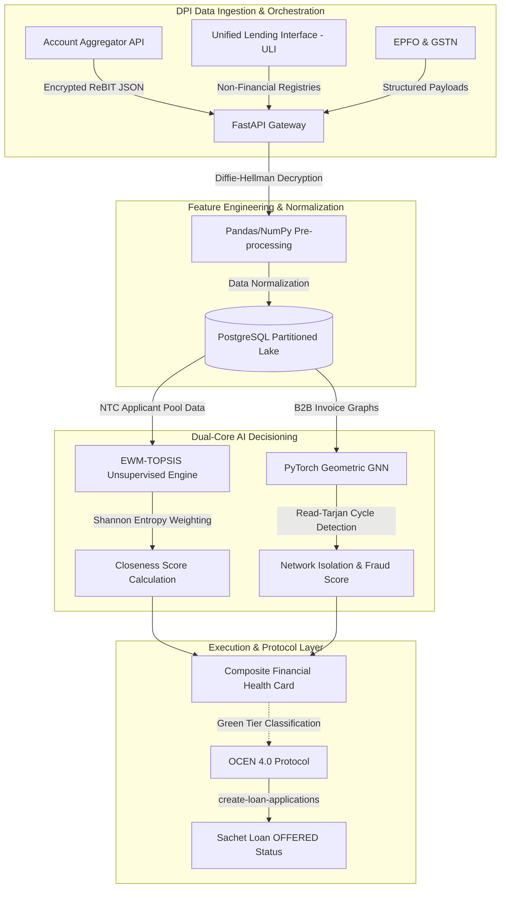

# 🏦 IDBI Innovate
### Track 03: Financial Health Score

*A state-of-the-art, DPI-native AI engine designed by **Team HackGrid** to provide zero-paperwork, cash-flow-based MSME credit decisioning in under 10 minutes.*
 

## 📖 Table of Contents
- [The MSME Credit Deficit](#-the-msme-credit-deficit)
- [Our DPI-Native Solution](#-our-dpi-native-solution)
- [System Architecture Blueprint](#-system-architecture-blueprint)
- [Mathematical Framework & Regulatory Compliance](#-mathematical-framework--regulatory-compliance)
- [Sandbox Execution Roadmap (Phase 2)](#-sandbox-execution-roadmap-phase-2)
- [Team HackGrid](#-team-hackgrid)

---

## 🚨 The MSME Credit Deficit
The Indian MSME sector encompasses over 63 million enterprises and drives nearly 49% of the nation's total exports, yet it suffers from a chronic credit deficit estimated at ₹20 trillion to ₹25 trillion. 

Traditional banking institutions rely heavily on audited balance sheets, extensive physical collateral, and historical credit bureau scores. Consequently, fewer than 11% of MSMEs possess access to formal commercial credit. This structurally excludes the vast majority of New-to-Credit (NTC) and New-to-Bank (NTB) Informal Micro Enterprises (IMEs) from the formal financial ecosystem.

---

## 💡 Our DPI-Native Solution
We are pioneering **Project VyaparDrishti**, an architecture that shifts the underwriting paradigm from asset-backed, collateral-first evaluation to dynamic, cash-flow-based digital lending. 

By leveraging India's Digital Public Infrastructure (DPI)—specifically the Unified Lending Interface (ULI), Open Credit Enablement Network (OCEN 4.0), and Account Aggregator (AA) framework—our engine extracts high-fidelity alternative data to assess risk instantly.

### ✨ Key Features
1. **Multidimensional Financial Health Card:** Maps normalized data across four orthogonal axes (Cash Flow Strength, Operational Resilience, Tax Compliance, and Supply Chain Health) to generate a composite tier.
2. **EWM-TOPSIS Cold-Start Engine:** Resolves the NTC algorithmic cold-start problem by dynamically assigning objective weights based on informational variance, bypassing the need for historical default labels entirely.
3. **Circular Trading Fraud Defense:** Employs Graph Neural Networks (GNNs) to map GST invoices as dense, directed edge-labeled multigraphs, detecting paper-only turnover and fraudulent ITC loops.
4. **Automated Population Stability Index (PSI) Kill Switch:** Continuously monitors data drift across the application pool; if macroeconomic shifts cause the PSI to breach the 0.10 threshold, the model auto-recalibrates its EWM weights without human intervention.

---

## 🏗️ System Architecture Blueprint

> [!NOTE]
> 

> 
> | Secure Ingestion ➡️ | Feature Extraction ➡️ | NTC Cold-Start Engine ➡️ | GNN Fraud Guardrails ➡️ | OCEN Execution 🎯 |
> | :--- | :--- | :--- | :--- | :--- |
> | • Account Aggregator • Unified Lending Interface • Diffie-Hellman Keys | • ReBIT JSON Schemas • UPI Velocity Gaps • HHI Concentration | • Scikit-Learn Pipeline • EWM Weighting • TOPSIS Matrices | • PyTorch Geometric • Directed Multigraphs • Cycle Enumeration[cite: 4] | • OCEN 4.0 Protocol • DPDP Data Purging • Instant Sanctions[cite: 4] |
> 
> 

> 
> ### 🧮 Mathematical Framework & Regulatory Compliance
> To strictly adhere to regulatory mandates and avoid the pitfalls of black-box supervised models that fail on NTC entities, our platform utilizes deterministic mathematical frameworks[cite: 4].
> 
> #### 1. Information Entropy (Cold Start Resolution)
> To quantify the informational uncertainty of each extracted feature and assign objective weights, we utilize Shannon Entropy[cite: 4]. The entropy $E_j$ for the $j$-th indicator is calculated as[cite: 4]:
> $$E_j = -\frac{1}{\ln(m)} \sum (p'_{ij} \ln(p'_{ij}))$$
> 
> #### 2. Population Stability Index (Data Drift Monitor)
> To ensure the model adapts to macroeconomic shifts, we track the symmetric Jeffreys divergence (Population Stability Index) continuously[cite: 4]:
> $$PSI(P,Q) = \sum (P_i - Q_i) \ln\left(\frac{P_i}{Q_i}\right)$$
> 
> #### 3. DPDP Act & Data Blindness
> All data routed through the Account Aggregator is secured via end-to-end Diffie-Hellman Key Exchange[cite: 4]. To ensure strict compliance with the Digital Personal Data Protection (DPDP) Act, automated cron jobs purge all ULI and AA data if a loan is rejected, maintaining purpose-limited Data Empowerment and Protection Architecture (DEPA) private inferencing[cite: 4].
> 
> ### 🚀 Sandbox Execution Roadmap (Phase 2)
> This repository represents the theoretical and architectural blueprint submitted for Phase 1 of IDBI Innovate. Upon shortlisting, our 3-week sprint will execute the following:
> 
> - [ ] **Week 1:** Map synthetic Goods and Services Tax (GST), UPI, and Account Aggregator (AA) payloads to our ReBIT JSON ingestion schema to simulate real-world DPI data flows[cite: 4].
> - [ ] **Week 2:** Code and implement the EWM-TOPSIS mathematical framework to successfully resolve the New-to-Credit (NTC) cold-start problem without relying on historical default labels[cite: 4].
> - [ ] **Week 3:** Deploy the Graph Neural Network (GNN) to detect topological circular trading cycles and wire the final outputs to the interactive "Financial Health Card" UI for the demo[cite: 4].
> 
> ### 👥 Team HackGrid
> 
> 

> 
> | Name | Role | Profile |
> | :--- | :--- | :--- |
> | **Ishita Goel** | Team Lead | Strategic Architecture & Risk Systems |
> | **Niyati Singhal** | Core ML Engineer | Multimodal Pipelines & PyTorch Optimization |
> | **Keya Chaturvedi** | Core ML Engineer | Multimodal Pipelines & PyTorch Optimization |
> | **Adarsh Jaiswal** | Core ML Engineer | Multimodal Pipelines & PyTorch Optimization |
> 
> 

> 
> **Notice:** *Code commits for the Proof of Concept (PoC) will begin following the official commencement of Phase 2 and access to sandbox data.*
